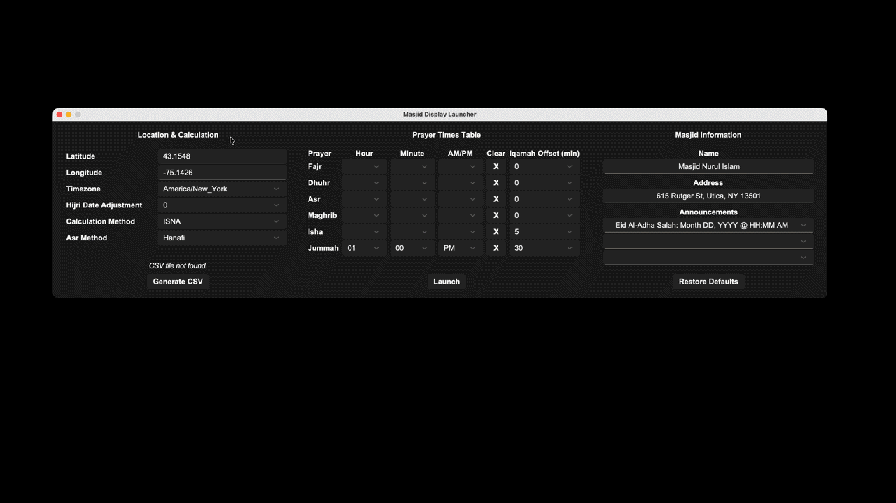

# Masjid Display

A local prayer timetable application for masjids, built with Python. It combines a **launcher UI** (Tkinter) for configuration and validation, a **long-range dataset** (CSV) for prayer timetable generation, and a **live display UI** (Pygame) for daily operation.

**The screen shows:**

- Current time and Gregorian/Hijri dates
- Masjid name and address
- Prayer table (Adhan and Iqamah) in English and Arabic
- Countdown to the next event
- Optional announcement panel

---

## Demo



---

## Start Guide

### 1. Open the Project Root

```bash
cd /path/to/MasjidDisplay
```

### 2. Create a Virtual Environment

```bash
python -m venv .venv
```

### 3. Activate the Virtual Environment

```bash
# macOS / Linux
source .venv/bin/activate

# Windows PowerShell
.venv\Scripts\Activate.ps1

# Windows Command Prompt
.venv\Scripts\activate.bat
```

### 4. Install Dependencies

```bash
pip install -r requirements.txt
```

### 5. Run the Launcher

```bash
python -m src.launcher
```

**First-Time Setup:**

1. Enter valid **Latitude/Longitude** and select **Timezone**, **Calculation Method**, and **Asr Method**.
2. Click **Generate CSV**.
3. Enter Masjid **Name** and **Address**.
4. Set the **Jummah** time (hour, minute, and AM/PM).
5. Click **Launch**.

> **Note:** If you change location, timezone, calculation method, or Asr method, regenerate the CSV before clicking **Launch**.

**Close the Display:**

Press `ESC` or close the window (`X`) to return to the launcher.

**Launch the Display Directly (Optional):**

```bash
python -m src.main
```

> Direct launch is supported, but launcher-first is recommended. Without a valid CSV, prayer data falls back to placeholders.

---

## How It Works

### 1. Prayer Time Calculation and CSV Generation

Prayer times are calculated using astronomical formulas derived from [PrayTimes.org](https://praytimes.org/docs/calculation), and saved to `data/data.csv` covering approximately 10 years from the current date.

**Calculation Engine (`src/data.py`)**

| Prayer | Method |
|--------|--------|
| Fajr / Isha | Sun angle below the horizon (method-specific) |
| Sunrise / Sunset | Atmospheric refraction adjustment (0.833°) |
| Dhuhr | Solar noon (equation of time) |
| Asr | Sun angle — Standard or Hanafi (see below) |
| Maghrib | Sunset time (solar noon + declination adjustment) |

**Asr Juristic Methods:**

- **Standard (Shafi, Maliki, Hanbali):** Shadow length = object height
- **Hanafi:** Shadow length = 2 × object height

**Implementation details:** Julian date conversion, solar declination and equation of time, trigonometric sun angle computations, and timezone/longitude adjustments for local accuracy.

**Supported Calculation Methods:** `MWL`, `ISNA`, `Egypt`, `Makkah`, `Karachi`, `Tehran`, `Jafari`, `France`, `Russia`, `Singapore`

### 2. Launcher (Configuration UI)

The launcher manages configuration, validation, and CSV generation:

- Per-prayer Adhan manual override times
- Per-prayer Iqamah offsets
- Masjid display identity (name and address)
- Up to 3 announcement messages

It auto-detects the local timezone and validates all input before saving.

### 3. Live Display

The Pygame display renders the live clock, Gregorian and Hijri dates, the prayer table, and the next-event countdown.

**Notable behaviors:**

- Next upcoming prayer/event is highlighted in the table.
- On Fridays, Dhuhr is replaced with Jummah.
- The Hijri date advances after Maghrib.
- A beep plays when the countdown hits zero.
- After all daily events pass, the countdown targets tomorrow's Fajr.
- If no valid CSV data exists for today, a fallback view is shown with placeholder values.

---

## Launcher Configuration Guide

### Location and Timezone

**Latitude and Longitude**

1. Open [Google Maps](https://maps.google.com)
2. Search for your Masjid or city (e.g., "Utica, NY")
3. Right-click on your location
4. Click the coordinates at the top of the menu — they copy automatically
5. Paste each value into its respective field

> **Tip:** Use your Masjid's exact coordinates for the most accurate times. Small differences within the same city have minimal impact.

**Timezone**

Select your timezone from the dropdown (IANA format, e.g., `America/New_York`, `Europe/London`). Your system timezone is auto-detected when available — verify it before proceeding.

### Adjustments & Methods

- **Hijri Date Adjustment:** Adjust if your local moon sighting differs from the calculated date (`-1`, `0`, or `+1` days).
- **Calculation Method:** Choose the method used by your local masjid (e.g., **ISNA** or **MWL** in North America).
- **Asr Juristic Method:** Standard (Shafi, Maliki, Hanbali) or Hanafi — select the one your masjid follows.

### Prayer Time Overrides

**Adhan Time**

Optionally set a fixed adhan time per prayer. Leave blank to use calculated times from the CSV.

- Select **hour** (1–12), **minute** (5-minute increments), and **AM/PM**.
- All three fields must be filled together.
- For non-Jummah prayers, the override cannot be earlier than the calculated time.

**Iqamah Offset**

Set how many minutes after Adhan the Iqamah is announced. Options: `0`, `5`, `10`, `15`, `20`, `30` minutes.

**Jummah**

- Adhan time is **required** and must be between `11:00 AM` and `3:00 PM`.

### Masjid Information

- **Name:** Up to 20 characters (required).
- **Address:** Up to 35 characters. Leave blank if unused.
- **Announcements:** Up to 3 messages, 45 characters each. Toggle display with `A`. Leave blank if unused.

  Pre-formatted templates are available:
  - `Eid Al-Fitr Salah: Month DD, YYYY @ HH:MM AM`
  - `Eid Al-Adha Salah: Month DD, YYYY @ HH:MM AM`

---

## Keyboard Controls (Display)

| Key | Action |
|-----|--------|
| `ESC` | Exit display and reopen launcher |
| `X` (window close) | Exit display and reopen launcher |
| `1` | Fullscreen preset (startup default) |
| `2` | 1280×720 window |
| `3` | 1600×900 window |
| `A` | Toggle announcements panel |

---

## Validation Rules

- **Latitude:** Must be between `-90` and `90`.
- **Longitude:** Must be between `-180` and `180`.
- **Timezone**, **calculation method**, and **Asr method** cannot be empty.
- **Masjid Name:** Required, max 20 characters.
- **Address:** Max 35 characters.
- **Announcements:** Max 45 characters each.
- **Prayer Time Entry:** Hour, minute, and AM/PM must all be set together — partial input is rejected.
- **Jummah:** Must be between `11:00 AM` and `3:00 PM`; all three fields required.
- **Launch:** Blocked if `data/data.csv` is not found or is outdated.

---

## Project Structure

```text
MasjidDisplay/
├── LICENSE
├── requirements.txt
├── README.md
├── assets/
│   ├── fonts/
│   │   ├── UKIJTuzKB.ttf
│   │   └── Bebas_Neue/
│   │       └── BebasNeue-Regular.ttf
│   ├── demo.gif
│   ├── beep.wav
│   └── texture.png
├── data/
│   ├── data.csv
│   └── settings.json
└── src/
    ├── launcher.py
    ├── main.py
    ├── data.py
    ├── config.py
    ├── utils.py
    ├── audio.py
    └── features/
        ├── background.py
        ├── display.py
        ├── table.py
        ├── countdown.py
        └── announcements.py
```

---

## Settings Reference (`data/settings.json`)

| Section | Key | Description |
|---------|-----|-------------|
| `DISPLAY` | `NAME` | Masjid name |
| `DISPLAY` | `ADDRESS` | Masjid address |
| `DISPLAY` | `ANNOUNCEMENTS` | List of up to 3 messages |
| `DATA.LOCATION` | `LATITUDE` | Decimal latitude |
| `DATA.LOCATION` | `LONGITUDE` | Decimal longitude |
| `DATA.LOCATION` | `TIMEZONE_NAME` | IANA timezone string |
| `DATA.LOCATION` | `HIJRI_DATE_ADJUSTMENT` | `-1`, `0`, or `1` |
| `DATA.CALCULATION` | `METHOD` | Prayer calculation method |
| `DATA.CALCULATION` | `JURISTIC_METHOD` | Asr juristic method |
| `DATA.PRAYERS` | `ADHAN_TIME` | Optional manual time (`HH:MM AM/PM`); required for Jummah |
| `DATA.PRAYERS` | `IQAMAH_OFFSET` | Minutes after adhan |

Per-prayer keys apply to: `FAJR`, `DHUHR`, `ASR`, `MAGHRIB`, `ISHA`, `JUMMAH`.

---

## Troubleshooting

**Display fails to start**
- Confirm required assets exist: `assets/texture.png`, `assets/fonts/Bebas_Neue/BebasNeue-Regular.ttf`, `assets/fonts/UKIJTuzKB.ttf`.
- Relaunch `python -m src.launcher` and verify settings/paths.

**CSV missing**
- Open the launcher and click **Generate CSV**.

**CSV outdated**
- Click **Generate CSV** again to refresh future dates.

**CSV generation failed**
- Most commonly caused by incorrect latitude/longitude values (including edge cases like ±90 or ±180).
- Confirm both coordinates are numeric and formatted correctly.
- Verify the timezone selection is valid.

**Display shows placeholders**
- Confirm today's date is present in `data/data.csv` and regenerate if needed.

**No beep at zero seconds**
- Check system volume and output device.
- Confirm `assets/beep.wav` exists.

**Reset settings to defaults**
- Delete `data/settings.json` and relaunch — defaults are recreated automatically.

---

## Requirements

- Python `3.12.x` (tested on `3.12.3`)
- macOS or Windows with display and audio support

*Linux may work but is not officially tested.*

---

## Dependencies

- `pygame`
- `numpy`
- `hijridate`
- `tzlocal`
- `arabic_reshaper`
- `python-bidi`
- `sv_ttk`

See [requirements.txt](requirements.txt) for pinned versions.

---

## Assets and Attribution

| Asset | Source | License |
|-------|--------|---------|
| `assets/texture.png` | [Freepik](https://www.freepik.com/free-vector/abstract-islamic-golden-pattern-backdrop-ethnic-style_297349472.htm) | Freepik License |
| `assets/beep.wav` | Generated locally via [src/audio.py](src/audio.py) | — |
| `assets/fonts/Bebas_Neue/BebasNeue-Regular.ttf` | [Google Fonts](https://fonts.google.com/specimen/Bebas+Neue) | SIL OFL 1.1 |
| `assets/fonts/UKIJTuzKB.ttf` | [Font Library](https://fontlibrary.org/en/font/ukij-tuz) | SIL OFL 1.1 |

---

## License

This project is licensed under the MIT License — see [LICENSE](LICENSE) for details.